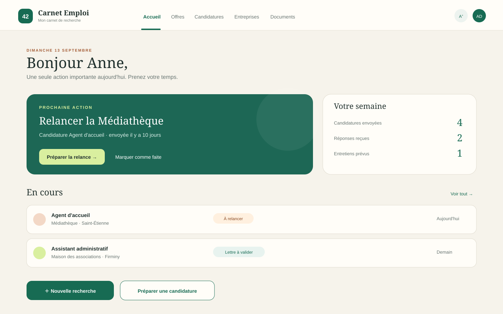
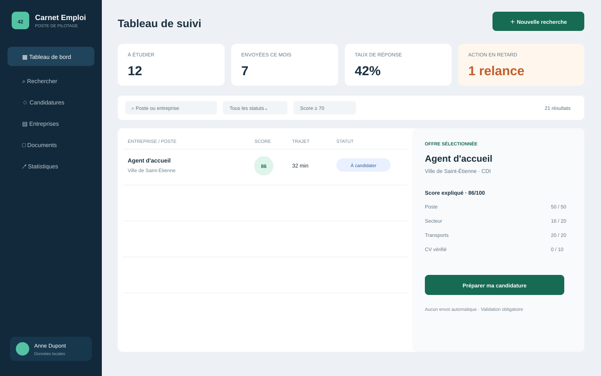
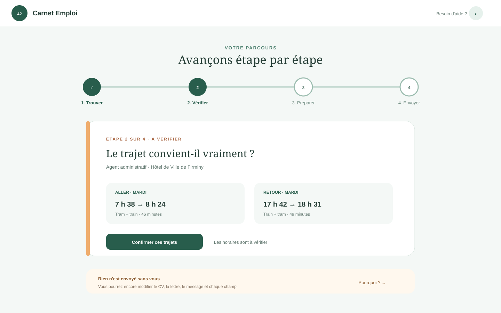

# Propositions de maquettes

Ces maquettes exploratoires ne contiennent aucune donnée réelle. Elles servent à choisir
la direction visuelle avant de généraliser les composants à toutes les rubriques.

## A — Carnet de route (recommandée)

Une interface chaleureuse et éditoriale, avec une grande zone « prochaine action », des
cartes souples et une couleur différente par niveau d'attention. Elle réduit la sensation
de tableau administratif et guide clairement la prochaine étape.

**Forces :** conviviale, rassurante, très lisible, adaptée à un usage quotidien.
**Compromis :** affiche moins de lignes simultanément que la proposition B.

## B — Poste de pilotage

Une vue dense pensée pour comparer beaucoup d'offres : navigation verticale, filtres
permanents, tableau compact et panneau de détail sans changement d'écran.

**Forces :** efficace pour le tri, beaucoup d'informations visibles.
**Compromis :** plus technique et moins accueillante lors des premières utilisations.

## C — Parcours guidé

Une interface calme centrée sur un parcours en quatre étapes : trouver, vérifier,
préparer, envoyer. Chaque écran se concentre sur une décision et rappelle la validation
humaine.

**Forces :** très accessible, charge cognitive faible, excellent sur petit écran.
**Compromis :** davantage de navigation pour les utilisateurs expérimentés.

## Socle commun proposé

- tableau de bord à l'ouverture, sans liste d'offres détaillée ni statistiques détaillées ;
- actions rapides « Nouvelle recherche », « Préparer une candidature » et « Notifications » ;
- thèmes clair et sombre, avec contraste conservé ;
- taille de texte agrandissable sans casser les cartes ;
- badges jamais fondés uniquement sur la couleur ;
- panneau de score expliquant systématiquement les quatre critères ;
- informations inconnues présentées comme « À vérifier », jamais comme un échec ;
- dernier clic d'envoi toujours réservé à l'utilisateur.

La direction **A — Carnet de route** est recommandée : elle équilibre mieux la densité
du suivi et le caractère rassurant attendu pour une application personnelle.

